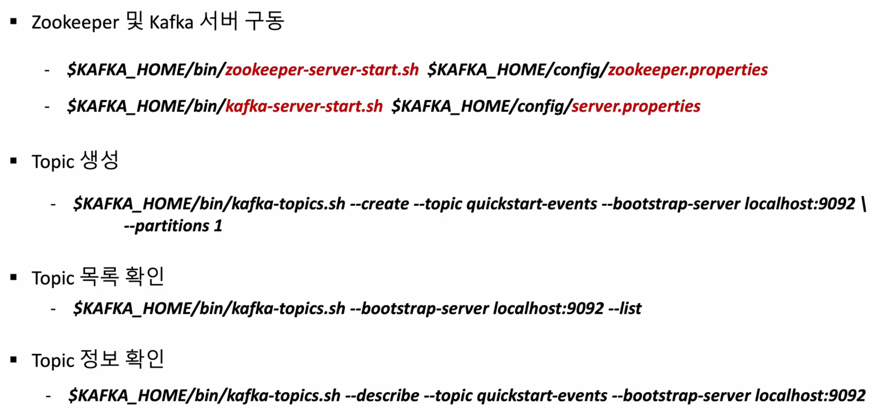
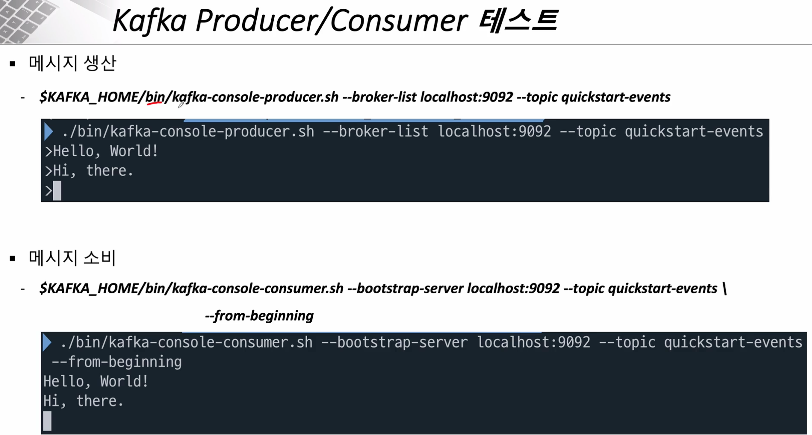
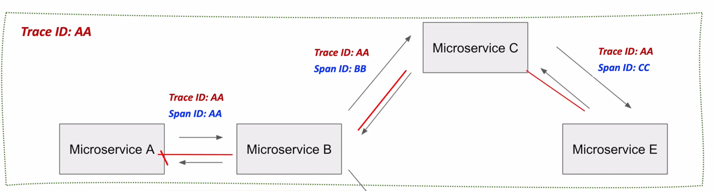
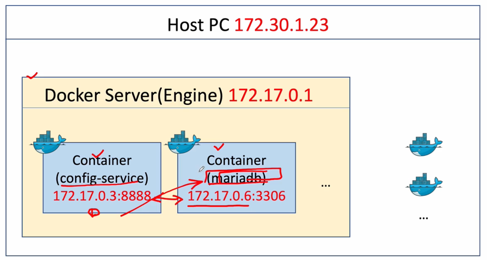
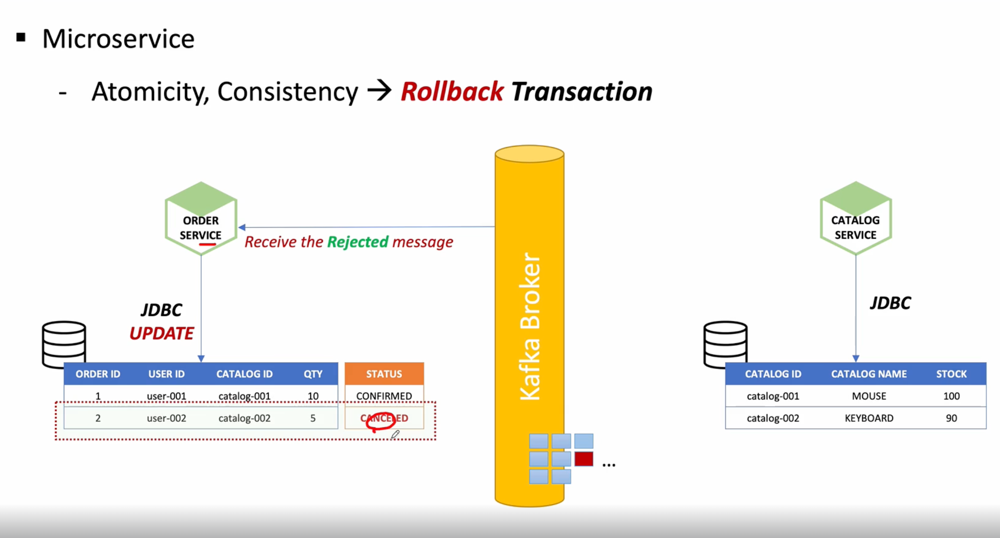
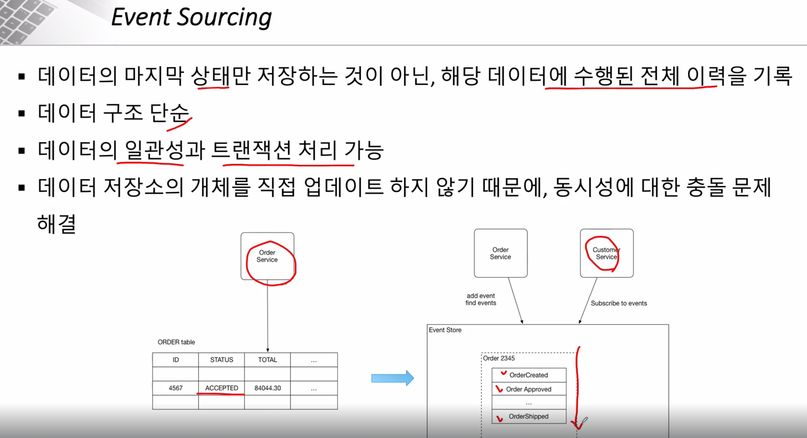
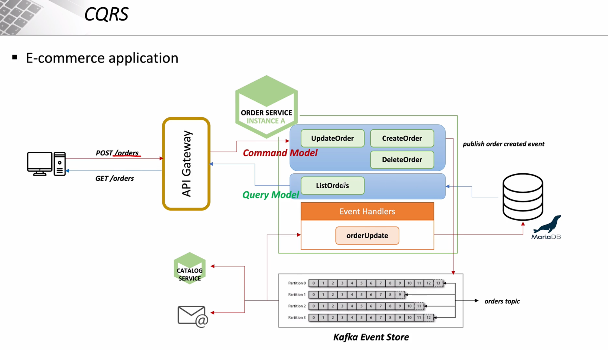
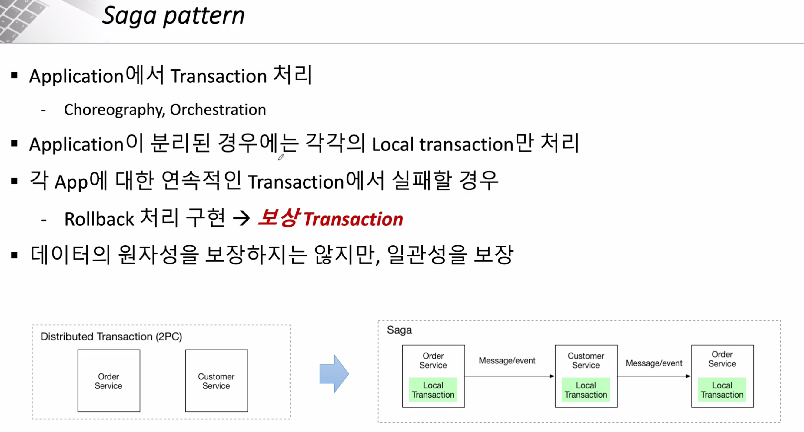

# Spring Cloud로 개발하는 마이크로서비스 애플리케이션(MSA) - 정수원

해당 강의를 수강하고 그와 관련된 기록을 남깁니다.

[강의 pdf](https://github.com/joneconsulting/msa_with_spring_cloud/tree/main/pdf)

[spring3.0 버전 코드](https://github.com/joneconsulting/toy-msa/tree/springboot3.2)

## Spring Cloud

Spring Boot + Spring Cloud 스프링 부트가 필수.

- 환경설정 정보: Spring Cloud Config Server
- 서비스 등록/ 위치 정보 확인 : Eureka
- Load Balancing : Spring Cloud Gateway
- 통신 : FeignClient -> Spring 3.0의 HTTP Framework 사용해봐도 될 듯
- 모니터링 : Netflix API gateway
- Fault Tolerance: Hystrix

## Spring Cloud Eureka

- key, value 형태로 서비스 목록 관리
- 각 서비스를 등록 후 Client의 요청이 Load Balancer 를 통해 각 서비스로 이동

## gradle 설명

https://techblog.woowahan.com/2625/

## API Gateway Service

- 인증 및 권한 부여
- 서비스 검색 통합
- 응답 캐싱
- 정책, 회로 차단기 및 QoS 다시 시도
- 속도 제한
- 부하 분산
- 로깅, 추적, 상관 관계
- 헤더, 쿼리 문자열 및 청구 변환
- IP 허용 목록에 추가

## Netflix Ribbon

- Spring Cloud에서의 MSA간 통신

  - RestTemplate
  - Feign Client
- Ribbon: **Client Side** Load Balancer

  - 로드 밸런싱을 위해 Ribbon 을 사용했으나, 비동기 지원이 안되어 사용 안함
  - 서비스 이름으로 호출
  - Health Check
  - 클라이언트 사이드에 심어진다.

## Netflix Zuul

- Middleware로 동작

But , ribbon, zuul 모두 maintenance 상태로 -> spring cloud gateway 쓰라고 되어 있음

## Spring Cloud

@ConfigurationProperties - Refresh 될 때 항상 Bean이 재생성 됨

vs

@RefreshScope - 해당 Bean은 프록시로 생성되고, 실제 Bean을 캐시에 저장. /refresh 될 때, Proxy의 bean이 destroy되고 캐시의 값을 초기화.

## Kafka

```bash
docker-compose -f docker-compose.yml up -d

kafka-topics --bootstrap-server localhost:9092 --list

kafka-console-consumer --bootstrap-server localhost:9092 --topic my_topic_users --from-beginning
```





### 설치 과정

https://velog.io/@imnooy/Kafka-Connect-%EC%82%AC%EC%9A%A9%ED%95%98%EA%B8%B0

```bash
brew tap confluentinc/homebrew-confluent-hub-client

brew install --cask confluent-hub-client

confluent-hub install confluentinc/kafka-connect-jdbc:latest --component-dir /Users/jack/99_Study/kafka-connect/component --worker-configs /Users/jack/99_Study/kafka-connect/config/worker.properties
```

## CircuitBreaker - Resilience4J

- MicroService 통신 시 연쇄 오류
- CircuitBreaker: 다른 서비스를 호출에 실패했을 때, 그 대신 다른 함수를 호출하고 장애 발생 서비스에 반복적인 호출이 되지 못하게 차단

## Micro Service 분산 추적

### Zipkin

- Span: 하나의 요청에 사용되는 작업 단위
- Trace: 트리구조로 이루어진 Span 세트. 하나의 요청에 대해 같은 Trace ID 를 발급

->  하나의 요청에 대해 여러 마이크로서비스로 연쇄적으로 요청이 일어날 때, 이 요청들은 같은 Trace Id를 가지고 각 요청들은 고유한 Span Id를 갖는다.

### Spring Cloud Sleuth, Zipkin

- Slueth: 스프링 부트가 가지고 있는 로그/스트리밍 데이터를 Zipkin에 전달
- Zipkin: Trace Id, Span Id를 생성 관리



## Container Virtualization

- 물리적인 컴퓨터 리소스를 다른 시스템이나 애플리케이션에서 사용할 수 있도록 제공
- Hypeprvisor: 가상화 플랫폼

## Gradle MSA 빌드 방법

```gradle
./gradlew userservice:build
```

## Docker Build

```bash
docker build -t jackyoon93/config-service:1.0 ./configservice
```

## MSA Docker 구성

docker network create --gateway 172.18.0.1 --subnet 172.18.0.0/16 ecommerce-network

docker network inspect ecommerce-network



```bash
docker run -d --name rabbitmq --network ecommerce-network -p 15672:15672 -p 5672:5672 -p 15671:15671 -p 5671:5671 -p 4369:4369 -e RABBITMQ_DEFAULT_USER=guest -e RABBITMQ_DEFAULT_PASS=guest rabbitmq:management
```

- 기본적으로 --network 옵션을 주지 않으면 기본 docker bridge network를 사용하게 되는데, 이럴 경우 다른 네트워크와 같이 저장되어 사용될 수 있어 별도 네트워크를 구성해주는게 좋음

## Event Driven Architecture



# Event Sourcing



## CQRS



## SAGA

- MSA 구조로 변경하며, DB 레벨에서 트랜잭션 처리를 하는 것이 아니라 Application Level 에서 트랜잭션을 처리하는 것을 말함



<enc>
