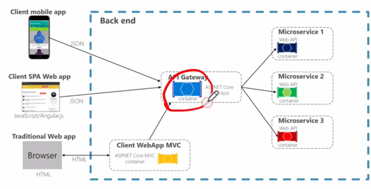

# Spring Cloud

Spring Boot + Spring Cloud 스프링 부트가 필수.

- 환경설정 정보: Spring Cloud Config Server
- 서비스 등록/ 위치 정보 확인 : Eureka
- Load Balancing : Spring Cloud Gateway
- 통신 : FeignClient -> Spring 3.0의 HTTP Framework 사용해봐도 될 듯
- 모니터링 : Netflix API gateway
- Fault Tolerance: Hystrix

# Spring Cloud Eureka

- key, value 형태로 서비스 목록 관리
- 각 서비스를 등록 후 Client의 요청이 Load Balancer 를 통해 각 서비스로 이동

## gradle 설명

https://techblog.woowahan.com/2625/

# API Gateway Service

- 인증 및 권한 부여
- 서비스 검색 통합
- 응답 캐싱
- 정책, 회로 차단기 및 QoS 다시 시도
- 속도 제한
- 부하 분산
- 로깅, 추적, 상관 관계
- 헤더, 쿼리 문자열 및 청구 변환
- IP 허용 목록에 추가

# Netflix Ribbon

- Spring Cloud에서의 MSA간 통신

  - RestTemplate
  - Feign Client
- Ribbon: **Client Side** Load Balancer

  - 로드 밸런싱을 위해 Ribbon 을 사용했으나, 비동기 지원이 안되어 사용 안함
  - 서비스 이름으로 호출
  - Health Check
  - 클라이언트 사이드에 심어진다.

# Netflix Zuul

- Middleware로 동작

But , ribbon, zuul 모두 maintenance 상태로 -> spring cloud gateway 쓰라고 되어 있음
